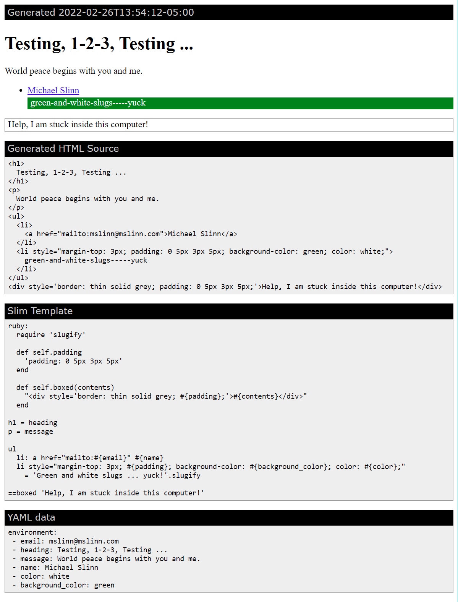

# Slim Language Explorer

https://user-images.githubusercontent.com/485818/155521347-856ca755-cb89-4bc7-97ce-fa69d091cf7a.mp4

[Slim](https://github.com/slim-template/slim#configuring-slim) is a cool way to generate a potentially complex HTML block with a minimum of characters.
Most often, Slim is thought of as an alternative to Ruby on Rail's ERB, however it is useful in a broad range of contexts.

When you are trying to figure out how to express HTML in Slim, however, you inevitably rerun the generation process over and over.
This git project consists of a small Ruby program that launches Slim, whenever a file is modified, created or deleted within the project.
This allows you to edit the Slim 'program', and view its output each time you save it.


## Installation
  1. [Install full Ruby](https://www.ruby-lang.org/en/documentation/installation/); this should include the development tools.
  2. Clone this git repo.
  3. Install dependent gems. From the cloned git repo directory, type:
     ```shell
     $ bundle install
     ```


## Slim Language REPL

In some sense, this is a REPL for the Slim Language.


### Command-line Mode
The video above demonstrates command-line mode running in Visual Studio Code.

  1) Start a bash shell and type:
     ```
     $ ./slim_explorer
     ```
     The contents of `watched/template.slim` are evaluated and stored into `www/raw.html`
     using the keys and values stored in file `watched/scope.yaml`.

  2) Use the editor of your choice to modify any file in the `watched` directory.

  3) The contents of `watched/template.slim` are re-evaluated and `www/raw.html` is updated each
    time a file in the `watched` directory is saved, created or deleted.
    This continues until interrupted.


### Web Server Mode

  1) Start a bash shell and type:
     ```
     $ ./slim_explorer serve
     ```
     The contents of `watched/template.slim` are evaluated and stored into `www/index.html`
     using the keys and values stored in file `watched/scope.yaml`.

  2) The file `www/index.html` will be generated.
     Open it in your favorite web browser, either from the file, or at [localhost:3030](http://localhost:3030).
     This is what it looks like:<br/>
    

  3) Use the editor of your choice to modify any file in the `watched` directory.

  4) The contents of `watched/template.slim` are re-evaluated and `www/index.html` is updated each time a file in
    the `watched` directory is saved, created or deleted.
